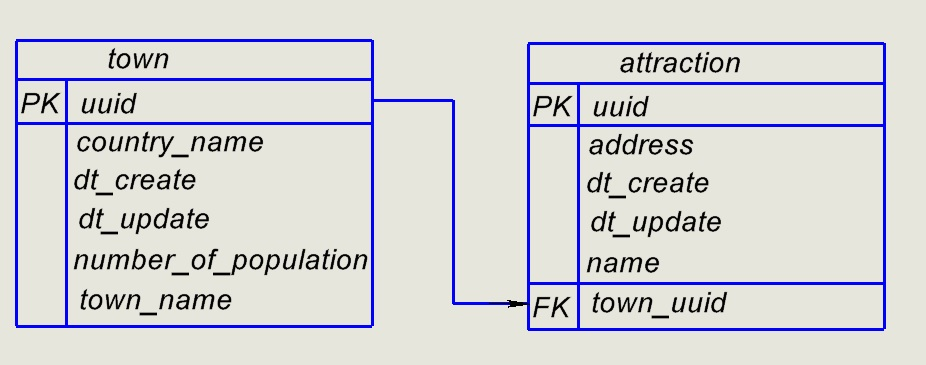

# Travel Guide

- The application is designed to create a database of cities and their attractions.
-
- Available options: add, view, edit and delete cities or their attractions.
-
- By default: all attractions are located in cities.
-
- First - the city is added, next -  their attraction(s).
-
- The application supports processing of incorrectly entered data.
-
 <b> Stack</b>:  Java 17, SpringBoot, Maven, PostgreSQL.
## To use the application::
- Download the project
- -
- In the  folder <b>postgresql </b>, first execute DDL queries, then DML queries
- -
- To test the application, use the Postman collection ( folder: <b> Postman Collection <b>). 
-----
 Contact me:  mikulichhanna@gmail.com
 Telegram: https://t.me/lancelot08

#Database table schema:
-

